# Description

This is a fully open-source data platform designed for efficient data ingestion, processing, storage, and analytics. It integrates multiple services to provide a seamless data pipeline, from collection to visualization.

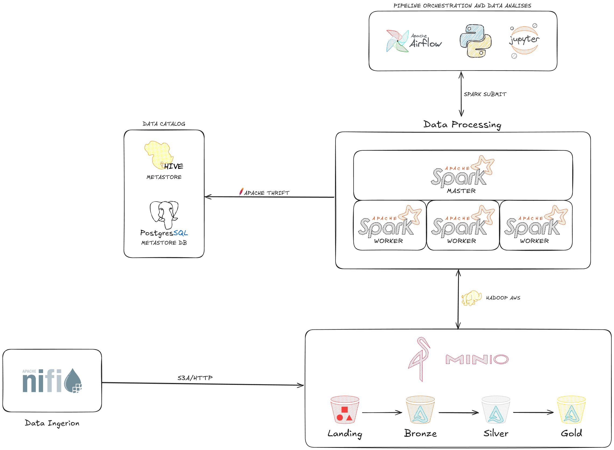

## Initial Setup

This Project uses a beta project as an auxiliar way to simplify the Spark process at the airflow step:

https://github.com/VictorLorenzo/data-framework

Realize that you can use other ways to process your data

### Data Framework - Git module
This Project is dedicated to create an ingestion framework that auxiliate the data engineer at the etl process on a delta lake with medalion architecture

* Runs the command
  ```sh
  git submodule update --init --recursive
  ```


### All services must be started in the order below:

#### 0. Network

To the data plataform comunicate with each other, it need a network

```sh
make network-create NETWORK=data-plataform
```

#### 1. SFTP – Secure file transfer for ingesting raw data.(optional)

* Run the comamnd at the terminal to up the containner
  ```sh
  cd sftp && make up
  ```

#### 2. MinIO – Object storage for scalable data management.

* Run the comamnd at the terminal to up the containner

  ```sh
  cd ../minio && make up
  ```
* Access the url http://localhost:9001/login
* Minio credentials

  ```
  user: accesskey
  password: secretkey
  ```
* At the minio UI, access the "Access Key" menu
  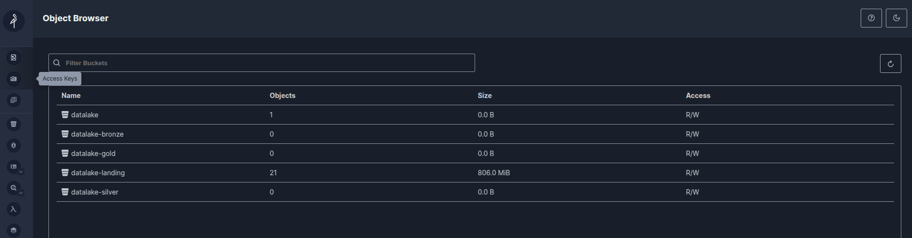
* Create an Access Key with this credentials

  ```
  accessKey: nifi,
  secretKey: nifipass,
  ```

  ```
  Access Key: trino
  Secret Key: trinopass
  ```
  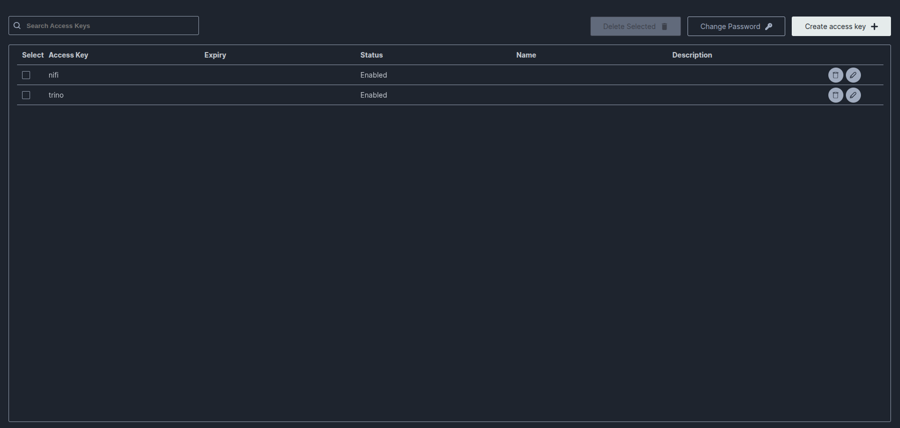

#### 3. NiFi – Automates data movement, ingestion and transformation.
If you want to use the templates available in this example, you need to follow the steps to create an account on IGDB.
https://api-docs.igdb.com/#getting-started

* Run the comamnd at the terminal to up the containner

  ```sh
  cd ../nifi && make up
  ```
* Access the url http://localhost:8443/nifi/
* At the nifi UI, upload your nifi ProcessGroup `./nifi/template/*.json`
  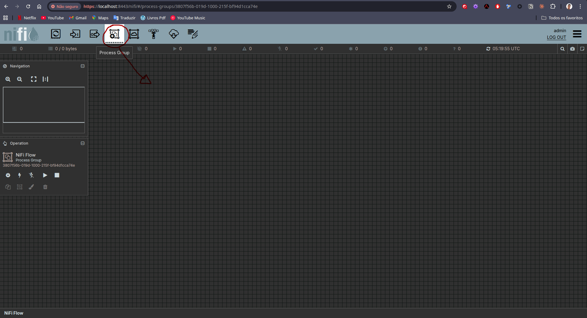
* Drag and drop to chose the uploaded template.
  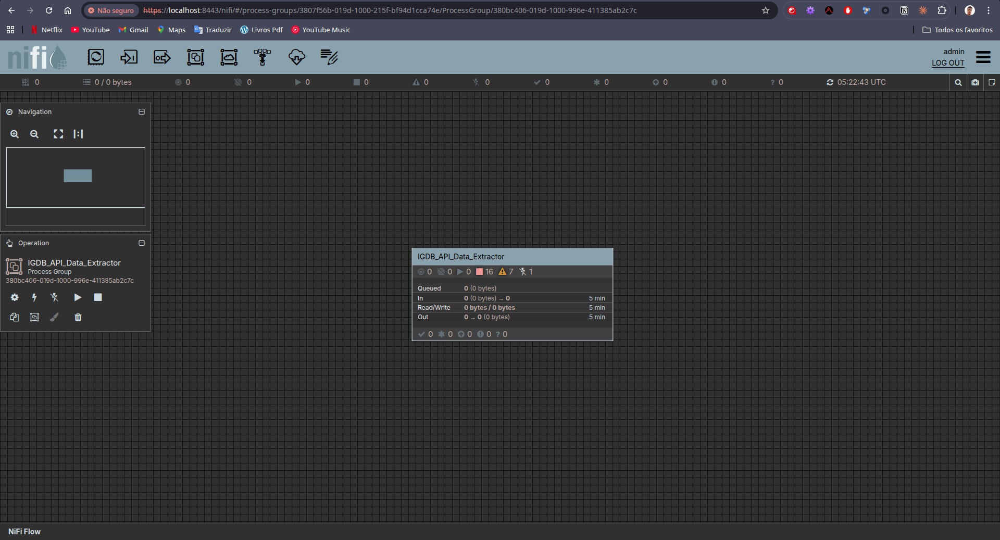
* Access the template double clicking at the group
* Set the parameter by right clicking on a blank space(optional).
  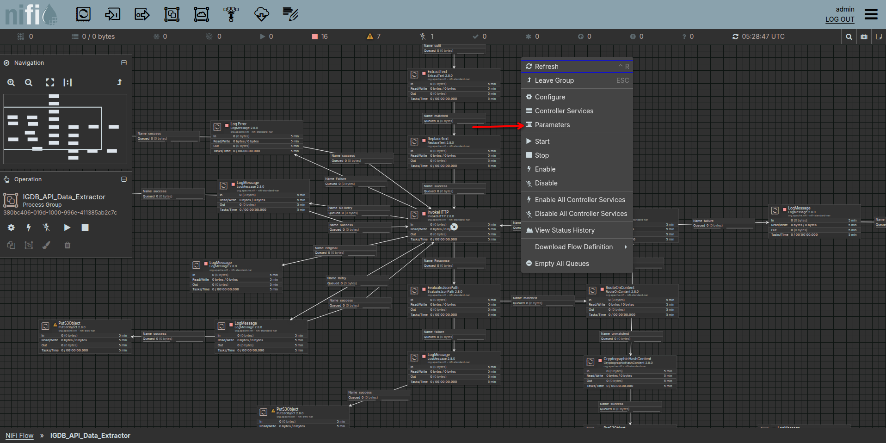
  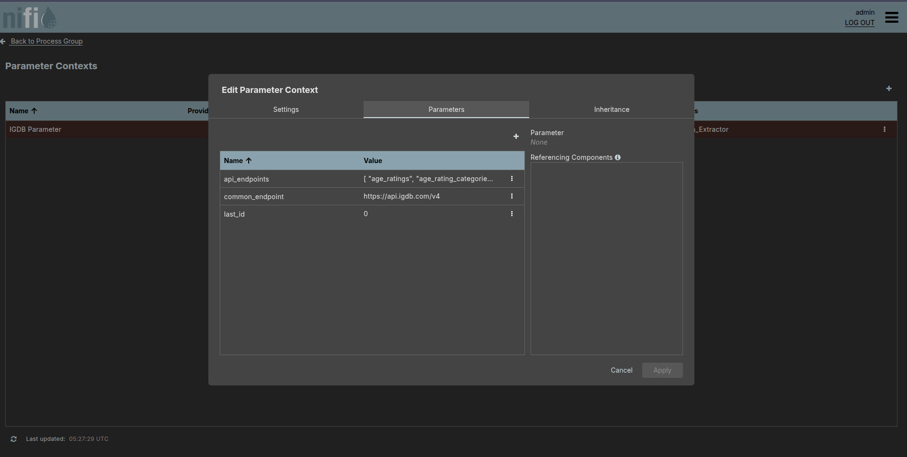
* On InvokeHttp, doble click it and create two essential properties (It is recommended to enable the sensitive data option. Don't forget, those credentials you get from https://api-docs.igdb.com/#getting-started.).
  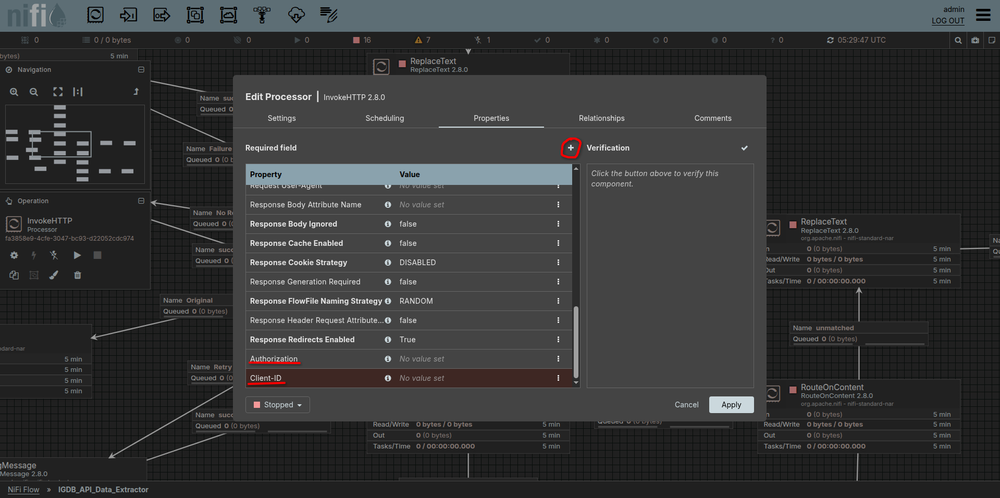
  ```
  Authorization: Bearer "Your Access Token",
  Client-ID: "Your Client-ID",
  ```

* Right click on a blank space and chose the "Controller Services" option and enable the controller.
  
  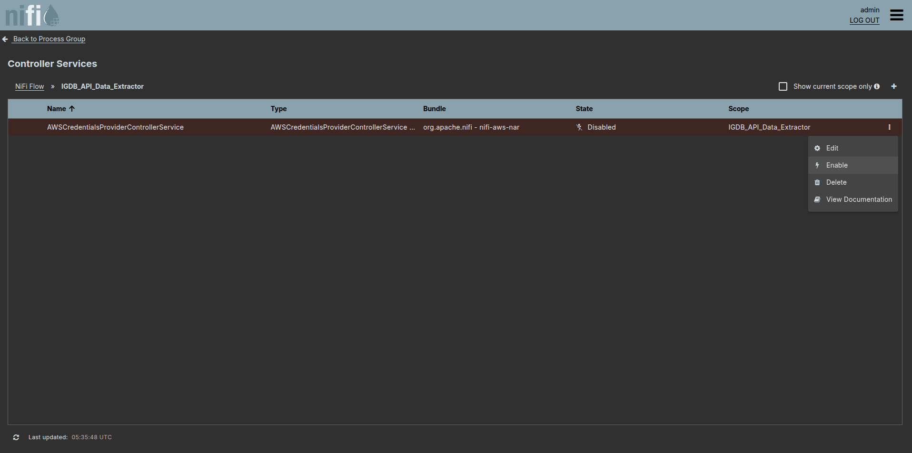

* Because you want to run it once for the start dump: Right click at "GenerateFlowFile" and Run once it, then deactivate so it cant run again in the flow
  

* Left Click on a blank space to select all flow and start the proccess
  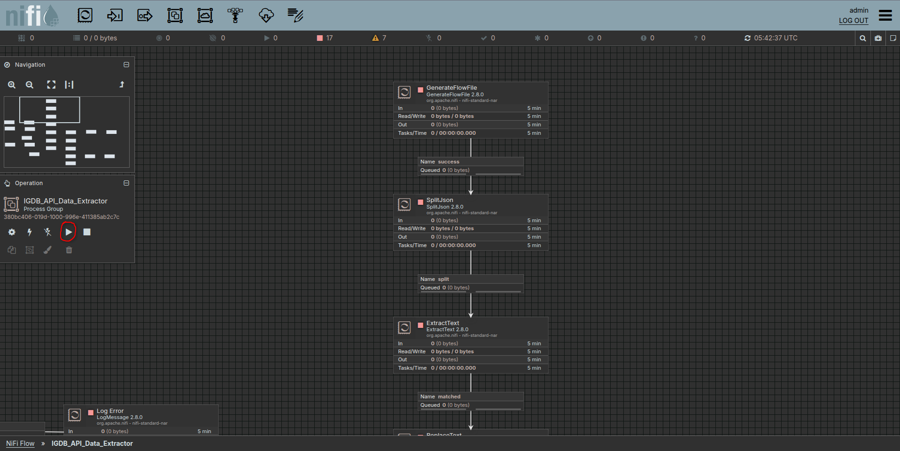
* Wait and watch the proccess, you can also see the files beign ingested at your lading-bucket
  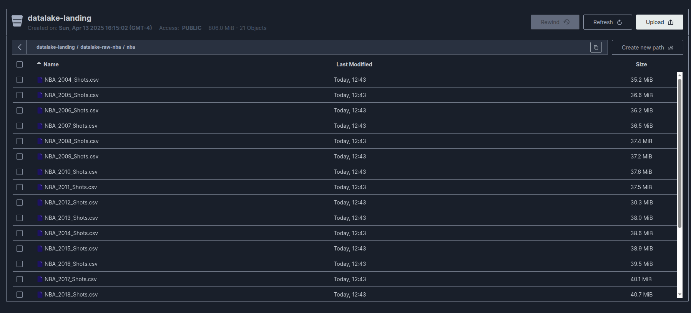

#### 4. Unity Catalog – Open-source data catalog with 3-level namespace (catalog.schema.table) for unified data governance.

* Run the command at the terminal to start the containers
  ```sh
  cd ../unity-catalog && make up
  ```
* Wait for the init container to finish (creates medallion catalogs and schemas automatically)
* Access the Unity Catalog UI at http://localhost:3001
* Access the REST API at http://localhost:8087/api/2.1/unity-catalog/catalogs
* Access the Swagger docs at http://localhost:8087/docs/#/
  ```
  Catalogs created: landing, bronze, silver, gold
  Schemas: default (in each catalog)
  ```

#### 5. Spark – Distributed data processing and analytics engine (Spark 3.5.3 + Delta Lake 3.2.1).

* Run the command at the terminal to start the containers

  ```sh
  cd ../spark && make up
  ```
* Access http://localhost:8082/ to watch your spark workers
  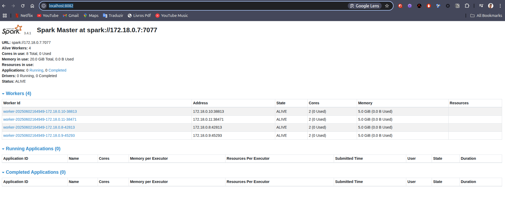
* Spark is pre-configured with Unity Catalog as the default catalog
* Access http://localhost:18080/ to see the process history

#### 6. Airflow – Workflow orchestration platform for authoring, scheduling, and monitoring data pipelines.

* Run the comamnd at the terminal to up the containner

  ```sh
  cd ../airflow && make up
  ```
* Access the url http://localhost:8080/login/

  ```
  user: airflow
  pass: airflow
  ```

Important for execute Spark Jobs.

Configure the Spark connection: In Airflow, go to Admin -> Connections and add a new connection. Set the Conn Id as spark_default, the Conn Type as Spark, and the Host as the address of your Spark master.
```
Connection Id: spark_default
Connection Type: Spark
Host: spark://spark-master
Port: 7077
```

Configure the airflow pools: In Airflow, go to Admin -> Pools and add a new pool. You can add more pools depending on the number of Spark Workers you have.
```
Pool: spark_local_pool
Slots: 4
Description: Limits concurrent Spark driver submissions to protect local system resources.
```


* Run your pipeline
  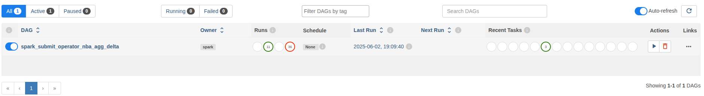
  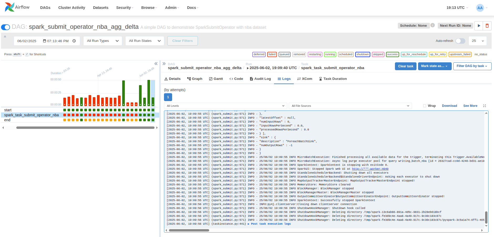

#### 7. Trino – Distributed SQL query engine for fast, interactive analytics across multiple data sources.
* Run the comamnd at the terminal to up the containner
  ```sh
  cd ../trino && make up
  ```
* Access http://localhost:8099/ui/ to see the cluster overview
  ```
  user: admin
  ```

#### 8. DBeaver – Database management and visualization tool.
* Run the comamnd at the terminal to up the containner
  ```sh
  cd ../dbeaver && make up
  ```

* Access http://localhost:8978/#/

* Chose a password and click next
  

* At the Top left corner click "+" --> "New Connection" and search for the Trino Connection

* Credentials:
  ```
  Driver: Trino
  Host: trino-coordinator
  port: 8080
  user: admin
  ```

* Now you're connected to the Unity Catalog
  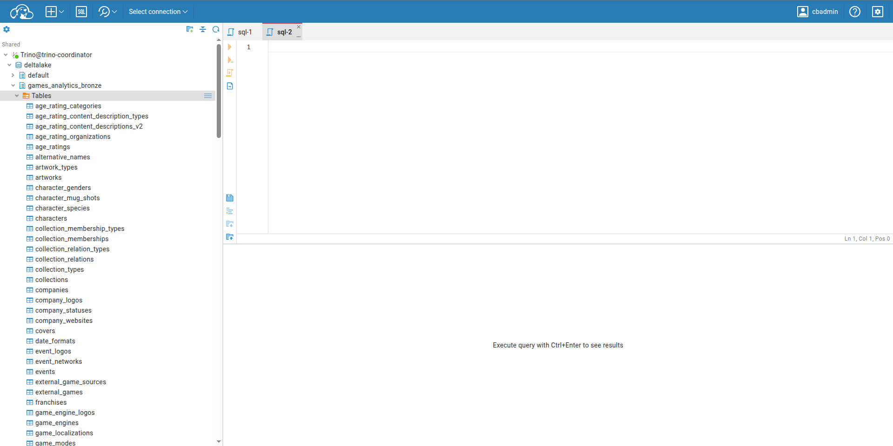

#### 9. Metabase – Open-source business intelligence tool for exploring, visualizing, and sharing data insights.
* Run the comamnd at the terminal to up the containner
  ```sh
  cd ../metabase && make up
  ```

* Access http://localhost:3000/

* Credentials:
  ```
  Host: trino-coordinator
  port: 8080
  user: admin
  ```

#### 10. Jupyter – Interactive computing environment for creating and sharing documents with live code, visualizations, and narrative text.

#### 11. Kyuubi – Distributed multi-tenant JDBC server for Apache Spark.

#### 12. Kafka – Distributed event streaming platform for building real-time data pipelines and applications.

#### 13. Debezium – Distributed platform for change data capture (CDC), streaming real-time changes from databases to other systems.

### More TODO
In the future i want to implement some ideas to automate some proccess:

* ~~Use Unity Catalog for data governance and data quality, also as catalog~~ ☑️ (Implemented - Unity Catalog OSS)

* Implement a more generic way to upload your ETL pipeline using json with jinja2 ☑️(Project in Beta)

* Add more data graphics

* Add more data integration such as with steam API ☑️(Project in Beta)

* Implement CI/CD proccess to upload your pipeline without commiting any new code

* Add more new feature from databricks

* Add Compatibility with AWS and Databircks

* Create clusterized environment using Kubernetes