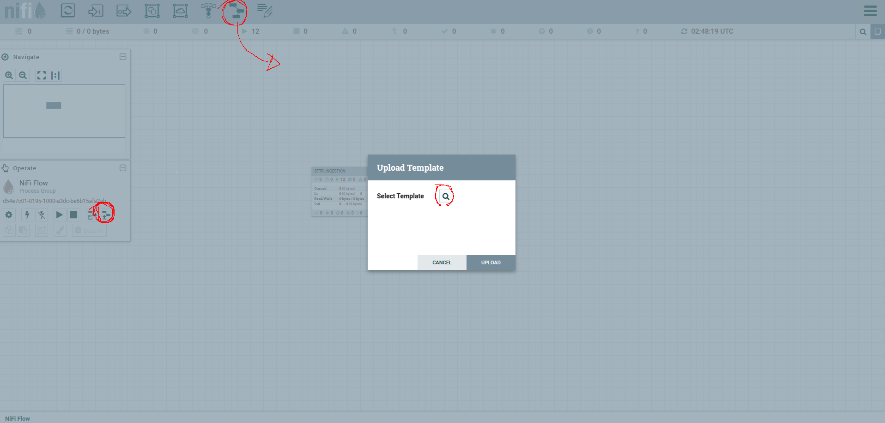

# Description
This is a fully open-source data platform designed for efficient data ingestion, processing, storage, and analytics. It integrates multiple services to provide a seamless data pipeline, from collection to visualization.
## Initial Setup

### All services must be started in the order below:

1. SFTP – Secure file transfer for ingesting raw data.

  * Run the comamnd at the terminal to up the containner
    ```sh
      cd sftp && make up
    ```

2. MinIO – Object storage for scalable data management.

  * Run the comamnd at the terminal to up the containner
    ```sh
      cd ../minio && make up
    ```
  
  * Access the url http://localhost:9001/login

  * Minio credentials
    ```
      user: accesskey
      password: secretkey
    ```

  * At the minio UI, access the "Access Key" menu 
    

  * Create an Access Key with this credentials
    ```
      accessKey: nifi
      secretKey: nifipass
    ```

3. NiFi – Automates data movement, ingestion and transformation.

  * Run the comamnd at the terminal to up the containner
    ```sh
      cd ../nifi && make up
    ```

  * Access the url http://localhost:8443/nifi/

  * At the nifi UI, upload your nifi template `./nifi/template/*.xml`
    

  * Drag and drop to chose the uploaded template
    

  * Access the template and set the variables of the platform
    
    

  * Change the password to LIST_SFTP AND FETCH_SFTP
    

  * 


4. Spark – Distributed data processing and analytics engine.
5. Hive – Data warehousing and querying for structured datasets.
6. DBeaver – Database management and visualization tool.
7. Airflow – Workflow orchestration for scheduling and monitoring data pipelines.

### Network
To the data plataform comunicate with each other, it need a network

```sh
  make network-create NETWORK=data-plataform
```

