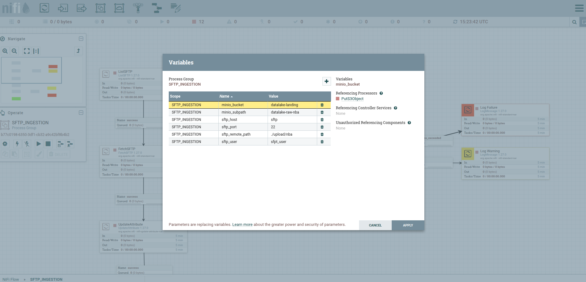
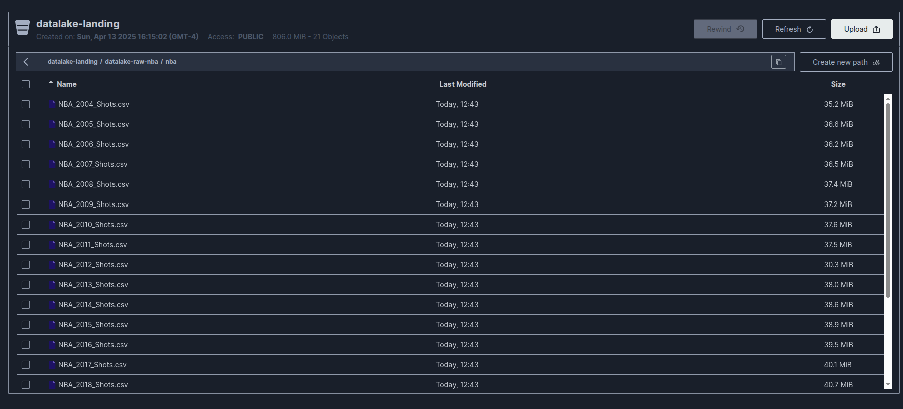

# Description

This is a fully open-source data platform designed for efficient data ingestion, processing, storage, and analytics. It integrates multiple services to provide a seamless data pipeline, from collection to visualization.


## Initial Setup

This Project uses a beta project as an auxiliar way to simplify the Spark process at the airflow step:

https://github.com/VictorLorenzo/data-framework

Realize that you can use other ways to process your data

### Data Framework - Git module
This Project is dedicated to create an ingestion framework that auxiliate the data engineer at the etl process on a delta lake with medalion architecture

* Runs the command
  ```sh
  git submodule update --init --recursive
  ```


### All services must be started in the order below:

#### 0. Network

To the data plataform comunicate with each other, it need a network

```sh
make network-create NETWORK=data-plataform
```

#### 1. SFTP – Secure file transfer for ingesting raw data.(optional)

* Run the comamnd at the terminal to up the containner
  ```sh
  cd sftp && make up
  ```

#### 2. MinIO – Object storage for scalable data management.

* Run the comamnd at the terminal to up the containner

  ```sh
  cd ../minio && make up
  ```
* Access the url http://localhost:9001/login
* Minio credentials

  ```
  user: accesskey
  password: secretkey
  ```
* At the minio UI, access the "Access Key" menu
  
* Create an Access Key with this credentials

  ```
  accessKey: nifi,
  secretKey: nifipass,
  ```

  ```
  Access Key: trino
  Secret Key: trinopass
  ```
  

#### 3. NiFi – Automates data movement, ingestion and transformation.
If you want to use the templates available in this example, you need to follow the steps to create an account on IGDB.
https://api-docs.igdb.com/#getting-started

* Run the comamnd at the terminal to up the containner

  ```sh
  cd ../nifi && make up
  ```
* Access the url http://localhost:8443/nifi/
* At the nifi UI, upload your nifi template `./nifi/template/*.xml`
  
* Drag and drop to chose the uploaded template.
  
* Access the template and set the variables by right clicking on a blank space and apply.
  
  
* On InvokeHttp, doble click it and create two essential properties (It is recommended to enable the sensitive data option.).
  
  ```
  Authorization: Bearer "Your Access Token",
  Client-ID: "Your Client-ID",
  ```

* Right click on a blank space and chose the "Configure" option and enable the controllers.
  


* Click on a blank space and start the proccess
  
* Wait and watch the proccess, you also can see the files beign ingested at your lading-bucket
  

#### 4. Spark – Distributed data processing and analytics engine.

* Run the comamand at the terminal to up the containner

  ```sh
  cd ../spark && make up
  ```
* Access http://localhost:8082/ to watch your spark workers
  

#### 5. Hive – Data warehousing and querying for structured datasets.

* Run the comamnd at the terminal to up the containner
  ```sh
  cd ../hive && make up
  ```

#### 6. Airflow – Workflow orchestration platform for authoring, scheduling, and monitoring data pipelines.

* Run the comamnd at the terminal to up the containner

  ```sh
  cd ../airflow && make up
  ```
* Access the url http://localhost:8080/login/

  ```
  user: airflow
  pass: airflow
  ```

Important for execute Spark Jobs.

Configure the Spark connection: In Airflow, go to Admin -> Connections and add a new connection. Set the Conn Id as spark_default, the Conn Type as Spark, and the Host as the address of your Spark master.
```
Connection Id: spark_default
Connection Type: Spark
Host: spark://spark-master
Port: 7077
```

* Run your pipeline
  
  

#### 7. Trino – Distributed SQL query engine for fast, interactive analytics across multiple data sources.
* Run the comamnd at the terminal to up the containner
  ```sh
  cd ../trino && make up
  ```
* Access http://localhost:8099/ui/ to see the cluster overview
  ```
  user: admin
  ```

#### 8. DBeaver – Database management and visualization tool.
* Run the comamnd at the terminal to up the containner
  ```sh
  cd ../dbeaver && make up
  ```

* Access http://localhost:8978/#/

* Chose a password and click next
  

* At the Top left corner click "+" --> "New Connection" and search for the Trino Connection

* Credentials:
  ```
  Driver: Trino
  Host: trino-coordinator
  port: 8080
  database: deltalake
  user: admin
  ```

* Now you're connected to the Hive Catalog
  

#### 9. Jupyter – Interactive computing environment for creating and sharing documents with live code, visualizations, and narrative text.

#### 10. Kyuubi – Distributed multi-tenant JDBC server for Apache Spark.

#### 11. Kafka – Distributed event streaming platform for building real-time data pipelines and applications.

#### 12. Debezium – Distributed platform for change data capture (CDC), streaming real-time changes from databases to other systems.

#### 13. Metabase – Open-source business intelligence tool for exploring, visualizing, and sharing data insights.

### More TODO
In the future i want to implement some ideas to automate some proccess:

* Use Unity Catalog for data governance and data quality, also as catalog

* Implement a more generic way to upload your ETL pipeline using json with jinja2 ☑️(Project in Beta)

* Add more data graphics

* Add more data integration such as with steam API ☑️(Project in Beta)

* Implement CI/CD proccess to upload your pipeline without commiting any new code

* Add more new feature from databricks

* Add Compatibility with AWS and Databircks

* Create clusterized environment using Kubernetes